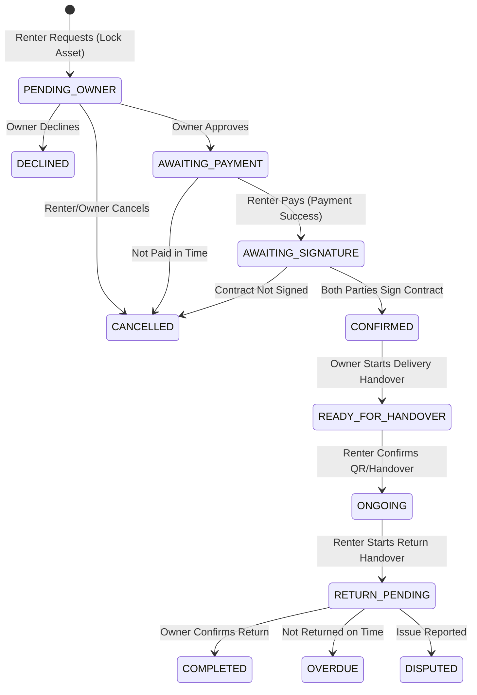

# Rental State Machine & Lifecycle

Borrow Hub implements a robust, secure, and transactional state machine for the rental lifecycle to prevent race conditions and ensure trust.

## 1. Flow Diagram

## 2. Race Condition & Concurrency Prevention
- **Booking Overlap Prevention**: The `create` method in `rentals.service.ts` uses a `FOR UPDATE` lock on the `Asset` row (`SELECT 1 FROM "assets" WHERE id = $1 FOR UPDATE`). This guarantees that concurrent bookings for the exact same asset are serialized at the database level.
- **Overlap Check**: Inside the transaction, it checks for any existing bookings with statuses `AWAITING_SIGNATURE, CONFIRMED, READY_FOR_HANDOVER, ONGOING, RETURN_PENDING, OVERDUE` that overlap the requested `startAt` and `endAt`.
- **Conclusion**: The backend is fully secured against double-booking race conditions.

## 3. Trust & Security
- **Smart Contracts (Digital)**: The system generates a digital contract (`rentalContract`) when payment is made. Both parties must sign it (`contractSignature`).
- **Payments & Payouts**: Handled securely. A `Payment` record is created for the renter, and a corresponding `Payout` record (minus commission) is queued for the owner.
- **Handover Verification**: Requires QR scanning (or manual confirmation) to transition into `ONGOING` and `COMPLETED`.

## 4. API Completeness
The REST API (`rentals.controller.ts`) perfectly mirrors these states, exposing endpoints like `approve`, `decline`, `cancel`, `recordPayment`, `signContract`, `startHandover`, `confirmHandover`.

**Status:** Phase 7 Audit & Validation COMPLETE. No missing API coverage.
